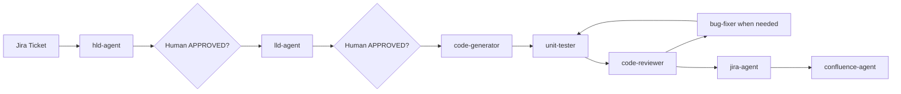

# Enterprise Copilot Agent Workspace

This repository is a production-grade GitHub Copilot agent workspace for driving a Jira ticket through high-level design, low-level design, implementation, tests, review, Jira updates, and Confluence documentation without leaving VS Code.

It is intentionally built like internal engineering enablement tooling for a 50-person product engineering organization: clear agent boundaries, human approval gates, Atlassian token discipline, repeatable validation, and operational documentation.

## What This Provides

- Six user-invocable Copilot skills in `.github/skills/`.
- Eight specialized Copilot agents in `.github/agents/`.
- Five reusable slash-command prompts in `.github/prompts/`.
- Permanent repository instructions in `.github/copilot-instructions.md`.
- Atlassian MCP configuration in `.vscode/settings.json`.
- Local and CI validation through `tools/validate-workspace.ps1`.
- Setup, operating, and PR documentation for portfolio-grade delivery.

## Workflow



## Quick Start

1. Replace the three environment placeholders:
   - `[YOUR_SITE_URL]`
   - `[YOUR_PROJECT_KEY]`
   - `[YOUR_SPACE_ID]`
2. Open the repository in VS Code.
3. Confirm GitHub Copilot Chat agent mode is enabled.
4. Confirm the Atlassian MCP server is available from `.vscode/settings.json`.
5. Complete the OAuth flow documented in `.github/MCP_SETUP.md`.
6. Run validation:

```powershell
powershell -ExecutionPolicy Bypass -File tools/validate-workspace.ps1
```

## Primary Command

Use `.github/prompts/full-sdlc.prompt.md` with a Jira ticket ID.

The workflow intentionally stops twice:

1. After HLD generation.
2. After LLD generation.

Both gates require the human to type `APPROVED` before the agent proceeds.

## Repository Standards

- Node.js 20, Express, PostgreSQL, React 18, TypeScript, Tailwind CSS.
- Zod validation for every external input.
- AppError for expected application failures.
- Structured logger utility, never production `console.log`.
- QueryBuilder for application database access, never raw SQL.
- JWT middleware on every route with zero exceptions.
- Feature flags through environment-backed configuration.
- Atlassian searches use `maxResults: 10`.
- Confluence pages are searched before creation.
- Confluence URLs are commented back on Jira tickets.

## Validation

The validation script checks:

- Required file inventory.
- Skill frontmatter and section structure.
- Agent frontmatter, section structure, and minimum execution steps.
- Exact STOP gate language.
- Critical hard constraints.
- Allowed placeholder hygiene.
- VS Code MCP JSON validity.
- GitHub Actions workflow presence.

Run it before publishing or demonstrating the project.

## Portfolio Positioning

This project demonstrates:

- Agentic workflow architecture.
- Human-in-the-loop SDLC control.
- MCP-based enterprise tool integration.
- Prompt and agent governance.
- Review and testing automation standards.
- Atlassian operational discipline.
